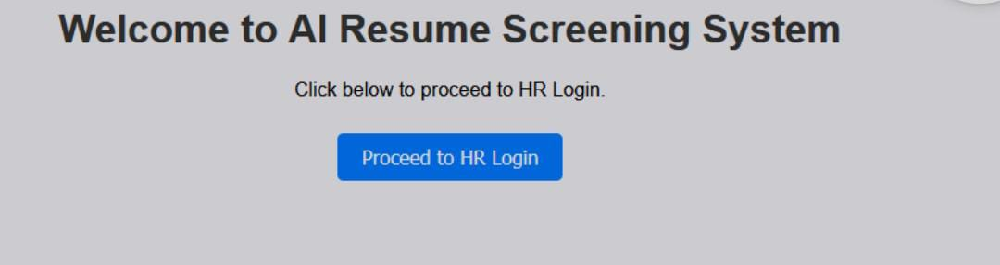
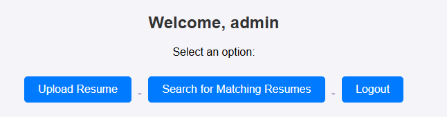
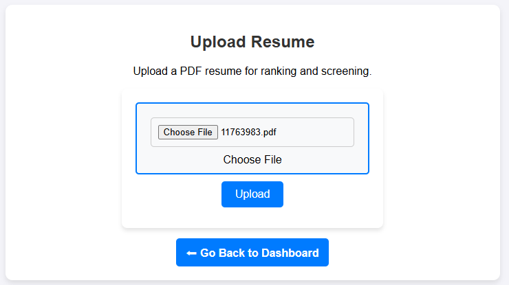
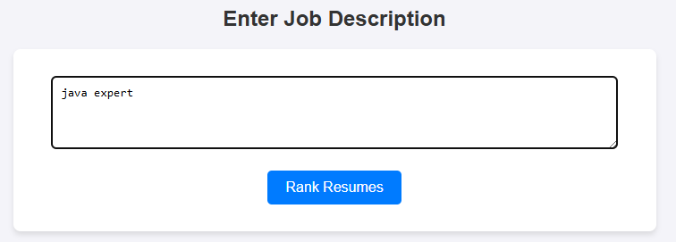
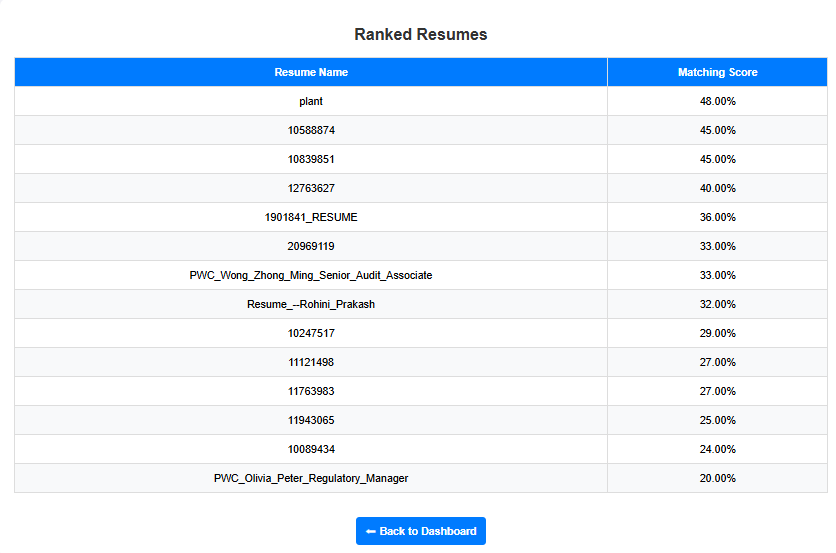

# SKILLMATCH-AI: AI-Powered Resume Screening System

The proposed system, **SKILLMATCH-AI**, is an AI-powered resume screening tool designed to streamline the recruitment process. It extracts data from resumes, processes the content using NLP for skill detection, ranks resumes using fuzzy logic, and optimizes the ranking score with a Genetic Algorithm-inspired technique — Particle Swarm Optimization (PSO). The system is built using **Flask (Python)** for the web interface, **Oracle Database** for data storage, and **spaCy** for natural language processing.

---

## System Architecture

The architecture of the SKILLMATCH-AI system automates and optimizes the resume screening process using artificial intelligence techniques. The workflow is as follows:

1. **HR Login:** The HR user securely logs into the system using credentials verified through session management.
2. **Resume Upload:** Once authenticated, the user can upload resumes in PDF format.
3. **Data Storage:** Uploaded resumes are stored securely in an Oracle database.
4. **NLP Processing:** Text extraction techniques using NLP are applied to extract relevant information from the resumes.
5. **Fuzzy Matching:** Extracted content undergoes fuzzy matching to identify relevant skills.
6. **Job Description Parsing:** HR user inputs a job description that is parsed to extract essential skill keywords.
7. **PSO Optimization:** Both the resume skills and job skills are fed into a Particle Swarm Optimization (PSO) module, which calculates the optimal weighting of each skill based on relevance.
8. **Ranking:** The system computes similarity scores and ranks the candidates, presenting HR with a prioritized list of suitable applicants.

---

## Features

- Secure HR login with session management
- Resume upload and PDF parsing with NLP (spaCy)
- Skill extraction using fuzzy logic
- Ranking optimization using Particle Swarm Optimization (PSO)
- Oracle Database integration for robust data storage
- User-friendly Flask web interface for easy navigation

---

## **Screenshots**

> Below are screenshots of the project:

### Welcome Page

### Dashboard

### Resume Upload

### Job-description Entry

### Ranked resumes

